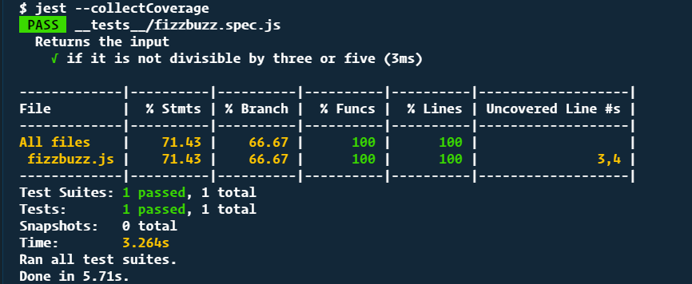
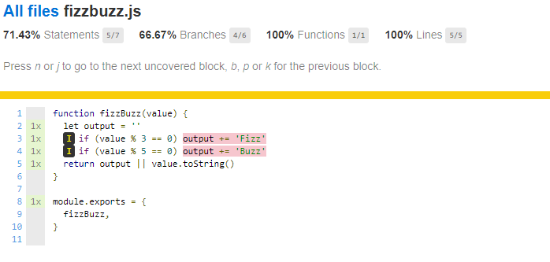
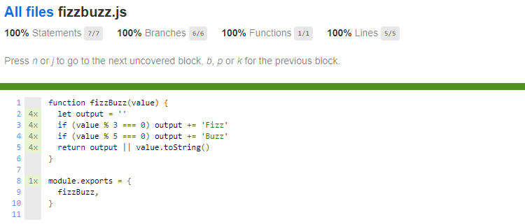

This post is not a post that says you have to have between X and Y percentage coverage throughout your code base.
It's an introduction post to code coverage, how to read it, and how you can use it in your workflow.

## Code coverage

Code coverage tells you which code has been executed during a test and how many times. I'm not telling to aim for X percentage of coverage, because this is entirely dependent on what you're creating. Targeting for 100% code coverage is often a mistake as it will take a lot of time (to get there and to maintain), and it can lead to problematic testing practices. Having a high percentage of coverage does not necessarily increase the quality, bugs will always pop up.

I use code coverage as a tool, as a last check to verify that the code is ready. It can discover edge cases we haven't thought of and it can make poorly written code visible.

## How to

My current go-to test framework is [Jest](https://jestjs.io), and this framework has code coverage built in. To generate the code coverage of your project, you can use the `--collectCoverage` flag.

```bash
jest --collectCoverage
```

The [Jest Configuration](https://jestjs.io/docs/en/configuration#defaults) allows you to configure some parameters as setting the threshold, paths to exclude from the coverage, and a couple more.

## An example

Let's put this in to practice. As a test we're going to take a look at the code coverage of a fizz buzz function.
FizzBuzz is a small function that, depending on the input will return a different output.
If the input value:

- is divisible by three it returns `Fizz`, e.g. 6
- is divisible by five, it returns `Buzz`, e.g. 20
- is divisible both three and five it returns `FizzBuzz`, e.g. 15
- otherwise it returns the input value, e.g. 7

A possible solution of the fizz buzz function looks a follows:

```js
function fizzBuzz(value) {
  let output = ''
  if (value % 3 == 0) output += 'Fizz'
  if (value % 5 == 0) output += 'Buss'
  return output || value.toString()
}
```

## Our first test

As our first test we're covering the easiest case, an input that is not divisible and simply returns the input value:

```js
describe('Returns the input', () => {
  it('if it is not divisible by three or five', () => {
    expect(fizzbuzz(7)).toBe('7')
  })
})
```

If we now generate the code coverage we see

A coverage report directly in the CLI:



A coverage report that can be opened in the browser (via `./coverage/lcov-report/index.html`):


It's even possible to click on the files to have a view to see which lines are covered, and which are not:



In all of the screenshots above, you have four different percentages
to look at.

From [Wikipedia](https://en.wikipedia.org/wiki/Code_coverage):

- Statement coverage – Has each statement in the program been executed?
- Branch coverage – Has each branch (also called DD-path) of each control structure (such as in if and case statements) been executed? For example, given an if statement, have both the true and false branches been executed? Notice that this one is a subset of Edge coverage.
- Function coverage – Has each function (or subroutine) in the program been called?
- Line coverage has each executable line in the source file been executed?

## Interpreting our code coverage

We can notice from the coverage that all of our lines are covered, but that not all of the statements have been covered. More specific, the lines where the input value is divisible by three and/or five.

If we would write the tests to cover the `Fizz` specs, we see that we now have 100% coverage - huzza 🎉!.

```js
describe('Fizz', () => {
  describe('Prints Fizz', () => {
    it('if it is divisible by three', () => {
      expect(fizzBuzz(3)).toBe('Fizz')
    })
  })

  describe('Does not print Fizz', () => {
    it('if it is not divisible by three', () => {
      expect(fizzBuzz(1)).not.toBe('Fizz')
    })

    it('if it is divisible by three and five', () => {
      expect(fizzBuzz(15)).not.toBe('Fizz')
    })
  })
})
```



Isn't it strange that we now have 100% coverage while we don't have the proper tests to cover a `Buzz` and `FizzBuzz` output?
This is because in our `Fizz` tests we verify that the output of a 'not divisible by three' input and a 'divisible by three and five' input, both not result in `Fizz`. By doing so, all of our statements are being executed, resulting in 100% code coverage. But this does not verify that all of our code is correct. In this specific case it wouldn't have caught the misspelled `Buzz` (we spelled it as `Buss`) in our program, but it still shows the 100% coverage.

## Code coverage in your workflow

Using code coverage to verify your own code or to help during a code review, brings the code in a different light. For me, seeing the lines highlighted often brings up several questions I didn't think of before. Asking myself why some code hasn't been executed, is one of these questions, especially when I think it should have been executed.

Complex and unmaintainable will become visible as these will be highlighted. There are better tools to track complex code blocks, but the code coverage viewer can be a good indication.

## Conclusion

While code coverage definitely has its value, it's easy to misinterpret the numbers. They do give the confidence to ship code and will most of the time lead to a more battle-tested application, but they **do not verify that all of the business requirements have been met, nor have been implemented correctly**.

Using code coverage as a tool to verify your thoughts has already saved me a couple of times, preventing unexpected bugs to ship.
Complex code, unreadable code will show up while looking at the code coverage, as it will probably have a low percentage. A possible cause is that the code is tangled, known as spaghetti code. This is where you'll have to decide to refactor the code or leave it as it is.
